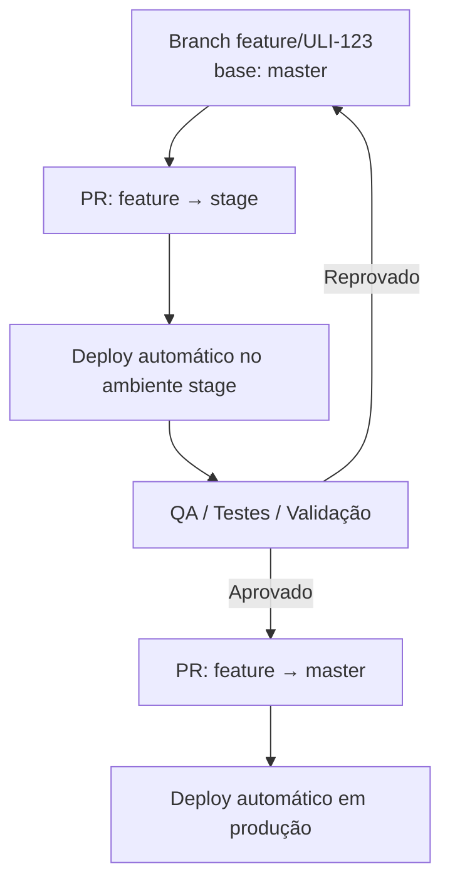

# 🧭 Engenharia de Software — uliving

Este documento define os padrões de engenharia adotados pelo departamento de tecnologia da **uliving**.

Nosso objetivo é garantir:

- qualidade de código
- previsibilidade no desenvolvimento
- facilidade de manutenção
- escalabilidade dos sistemas

---

## Fluxo

## 🌳 Git Workflow (stage como ambiente de validação)

```mermaid
gitGraph
    commit id: "master"

    branch stage
    checkout stage
    commit id: "stage baseline"

    checkout master
    branch feature/ULI-123
    checkout feature/ULI-123
    commit id: "development"
    commit id: "feature ready"

    checkout stage
    merge feature/ULI-123
    commit id: "deploy stage"

    checkout master
    merge feature/ULI-123
    commit id: "deploy production"
```
## 🌳 Git Workflow (master → stage → master)

Nosso fluxo segue um modelo próximo ao **Trunk-Based Development**, utilizando um ambiente de **staging** para validação antes da promoção para produção.



---

## Processo de desenvolvimento

1. Criar branch a partir de **staging**

```
feature/ULI-123-descricao
```

2. Desenvolver a funcionalidade

3. Abrir Pull Request para **staging**

4. Após merge em staging:

- deploy automático em staging
- validação funcional
- testes

5. Após validação:

```
merge staging → main
```

6. Deploy em produção

---

# 🌿 Padrão de Branch

Toda branch deve estar vinculada a um ticket do **Jira**.

## Formato

```
tipo/ULI-123-descricao-curta
```

## Exemplos

```
feature/ULI-245-criar-endpoint-reservas
fix/ULI-310-corrigir-bug-checkout
refactor/ULI-500-refatorar-servico-pagamentos
chore/ULI-120-ajustar-eslint
```

## Tipos permitidos

| Tipo | Descrição |
|-----|-----|
| feature | nova funcionalidade |
| fix | correção de bug |
| refactor | refatoração |
| chore | tarefas técnicas |
| docs | documentação |
| hotfix | correção urgente |

---

# 🔀 Pull Requests

Todo código deve passar por **Pull Request** antes de ser integrado.

## Requisitos obrigatórios

- branch atualizada com staging
- CI passando
- descrição clara da mudança
- link do ticket Jira
- pelo menos **1 aprovação**

---

## Estrutura de PR

Um bom PR deve conter:

### Contexto

Explique o problema.

### O que foi feito

Lista objetiva das mudanças.

### Como testar

Passo a passo de validação.

### Evidências

Screenshots ou logs quando necessário.

---

# 🚑 Hotfix

Correções críticas podem ser feitas diretamente a partir de `main`.

```mermaid
gitGraph
   checkout main
   branch hotfix/ULI-500
   commit id: "fix production bug"

   checkout main
   merge hotfix/ULI-500
   commit id: "deploy hotfix"

   checkout staging
   merge main
```

Após aplicar o hotfix em produção, **staging deve ser sincronizado**.

---

# 🧼 Clean Code

Seguimos princípios de **Clean Code** para manter o código legível e sustentável.

## Princípios

### Nomes descritivos

Prefira:

```
calculateInvoiceTotal()
```

Evite:

```
calcInv()
```

---

### Funções pequenas

Uma função deve ter **uma única responsabilidade**.

---

### Evitar duplicação

Siga o princípio **DRY (Don't Repeat Yourself)**.

---

### Baixo acoplamento

Componentes devem ser independentes sempre que possível.

---

### Alta coesão

Cada módulo deve ter responsabilidade clara.

---

# 🏗️ Clean Architecture

Adotamos princípios de **Clean Architecture**.

## Camadas

```
Presentation
Application
Domain
Infrastructure
```

---

## Domain

Contém regras de negócio puras.

Exemplos:

- entidades
- value objects
- regras de negócio

Não deve depender de frameworks.

---

## Application

Contém os **casos de uso**.

Responsável por orquestrar o domínio.

---

## Infrastructure

Implementações técnicas:

- banco de dados
- mensageria
- APIs externas

---

## Presentation

Camada de entrada:

- controllers
- APIs
- interfaces

---

## Regra principal

Dependências sempre apontam **para dentro**.

```
Presentation → Application → Domain
Infrastructure → Application
```

---

# 🧪 Testes

Tipos de testes recomendados:

### Unitários

Validam regras de negócio.

### Integração

Validam comunicação entre serviços.

---

## Boas práticas

- testes determinísticos
- evitar dependência de infraestrutura real
- priorizar testes de domínio

---

# 📦 Versionamento

Utilizamos versionamento baseado em **SemVer**.

```
MAJOR.MINOR.PATCH
```

---

# 🔐 Segurança

Boas práticas:

- nunca commitar secrets
- validar inputs
- sanitizar logs
- manter dependências atualizadas

---

# ✅ Definition of Done

Uma tarefa é considerada concluída quando:

- código implementado
- testes atualizados
- PR aprovado
- CI passando
- deploy validado em staging
- documentação atualizada quando necessário

---

# 🚀 Cultura de Engenharia

Na uliving acreditamos que:

- código é responsabilidade coletiva
- refatoração é parte do trabalho
- qualidade é prioridade
- documentação faz parte da entrega
