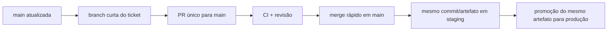

# 🧭 Engenharia de Software — uliving

Este documento define os padrões de engenharia adotados pelo departamento de tecnologia da **uliving**.

Nosso objetivo é garantir:

- qualidade de código
- previsibilidade no desenvolvimento
- facilidade de manutenção
- escalabilidade dos sistemas

---

## Fluxo trunk-based

`main` é o único trunk e a única branch permanente. Não existem branches permanentes `develop`,
`development`, `stage`, `staging` ou `release` para promover código entre ambientes. Branches
`fix/*` e `hotfix/*` são curtas e seguem o fluxo de produção descrito abaixo.


```mermaid
flowchart LR
  A[main atualizada] --> B[branch curta do ticket]
  B --> C[PR único para main]
  C --> D[CI + revisão]
  D --> E[merge rápido em main]
  E --> F[mesmo commit/artefato em staging]
  F --> G[promoção do mesmo artefato para produção]
```

Staging é um ambiente de validação, não uma branch. A promoção entre ambientes usa o mesmo commit ou
artefato imutável já integrado em `main`; não exige novo merge ou segundo PR.

---

## Processo de desenvolvimento

1. Atualizar `main` e criar uma branch curta a partir dela.

```
feature/ULT-123-descricao
```

2. Entregar uma mudança pequena, completa e sempre integrável. Funcionalidade incompleta permanece
   protegida por feature flag desativada por padrão.
3. Sincronizar frequentemente com `main` e resolver conflitos enquanto o diff ainda é pequeno.
4. Abrir um único Pull Request para `main`.
5. Após CI e aprovação, integrar rapidamente e remover a branch curta.
6. Validar em staging e promover para produção o mesmo commit/artefato aprovado.

---

# 🌿 Padrão de Branch

Toda branch deve estar vinculada a um ticket do **Jira**.

## Formato

```
tipo/ULT-123-descricao-curta
```

## Exemplos

```
feature/ULT-245-criar-endpoint-reservas
fix/ULT-310-corrigir-bug-checkout
refactor/ULT-500-refatorar-servico-pagamentos
chore/ULT-120-ajustar-eslint
```

## Tipos permitidos

| Tipo     | Descrição           |
| -------- | ------------------- |
| feature  | nova funcionalidade |
| fix      | correção de bug     |
| refactor | refatoração         |
| chore    | tarefas técnicas    |
| docs     | documentação        |

Branches devem durar o mínimo possível.

## Fix e hotfix da versão em produção

Quando `main` possuir features ainda em validação, uma correção destinada à versão em produção não
pode partir dela:

1. Confirmar qual é a última tag efetivamente implantada em produção.
2. Criar `fix/ULT-123-descricao` ou `hotfix/ULT-123-descricao` a partir dessa tag.
3. Implementar somente a correção e validar contra a mesma linha de produção.
4. Revisar o diff, executar o CI e publicar uma nova tag/artefato imutável desse commit.
5. Promover o artefato corrigido diretamente para produção.
6. Reintegrar imediatamente o mesmo commit em `main` por PR ou cherry-pick.

Esse fluxo é uma exceção de origem para preservar a versão em produção, não uma branch permanente
nem uma linha paralela de desenvolvimento.

## Feature flags

Mudança de alto impacto em regra de negócio deve avaliar feature flag. Antes de implementar, agentes
de IA perguntam explicitamente ao usuário se a proteção deve ser aplicada. A decisão, o estado
inicial, a estratégia de ativação, observação, rollback e remoção ficam registrados no PR.

---

# 🔀 Pull Requests

Todo código deve passar por **Pull Request** antes de ser integrado.

## Requisitos obrigatórios

- branch criada de `main`; ou, para `fix/hotfix` de produção, da última tag implantada
- CI passando
- descrição clara da mudança
- link do ticket Jira
- pelo menos **1 aprovação**
- um único PR direcionado a `main`
- decisão sobre feature flag registrada quando houver regra de negócio de alto impacto

---

## Estrutura de PR

Um bom PR deve conter:

### Contexto

Explique o problema.

### O que foi feito

Lista objetiva das mudanças.

### Como testar

Passo a passo de validação.

### Evidências

Screenshots ou logs quando necessário.

---

# 🧼 Clean Code

Seguimos princípios de **Clean Code** para manter o código legível e sustentável.

## Princípios

### Nomes descritivos

Prefira:

```
calculateInvoiceTotal()
```

Evite:

```
calcInv()
```

---

### Funções pequenas

Uma função deve ter **uma única responsabilidade**.

---

### Evitar duplicação

Siga o princípio **DRY (Don't Repeat Yourself)**.

---

### Baixo acoplamento

Componentes devem ser independentes sempre que possível.

---

### Alta coesão

Cada módulo deve ter responsabilidade clara.

---

# 🏗️ Clean Architecture

Adotamos princípios de **Clean Architecture**.

## Camadas

```
Presentation
Application
Domain
Infrastructure
```

---

## Domain

Contém regras de negócio puras.

Exemplos:

- entidades
- value objects
- regras de negócio

Não deve depender de frameworks.

---

## Application

Contém os **casos de uso**.

Responsável por orquestrar o domínio.

---

## Infrastructure

Implementações técnicas:

- banco de dados
- mensageria
- APIs externas

---

## Presentation

Camada de entrada:

- controllers
- APIs
- interfaces

---

## Regra principal

Dependências sempre apontam **para dentro**.

```
Presentation → Application → Domain
Infrastructure → Application
```

---

# 🧪 Testes

Tipos de testes recomendados:

### Unitários

Validam regras de negócio.

### Integração

Validam comunicação entre serviços.

---

## Boas práticas

- testes determinísticos
- evitar dependência de infraestrutura real
- priorizar testes de domínio

---

# 📦 Versionamento

Utilizamos versionamento baseado em **SemVer**.

```
MAJOR.MINOR.PATCH
```

---

# 🔐 Segurança

Boas práticas:

- nunca commitar secrets
- validar inputs
- sanitizar logs
- manter dependências atualizadas

---

# ✅ Definition of Done

Uma tarefa é considerada concluída quando:

- código implementado
- testes atualizados
- PR aprovado
- CI passando
- deploy validado em staging
- documentação atualizada quando necessário

---

# 🚀 Cultura de Engenharia

Na uliving acreditamos que:

- código é responsabilidade coletiva
- refatoração é parte do trabalho
- qualidade é prioridade
- documentação faz parte da entrega
